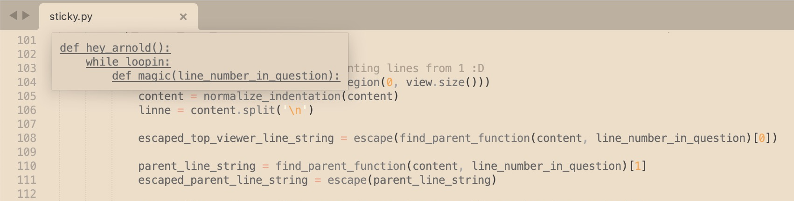

## Sticky

A clumsy little attempt to implement VSCode's "sticky lines" feature on Sublime Text. <br>
Since there's no full webview support, and also because I'm a mess, the thing is quite workaround-y. <br>
I'll try to find a better way, but now it loops indefinitely to monitor changes in `view.visible_region` in real time. It is offensively ineffective haha. You can adjust `fps` variable to save some CPU.

Update: fixed `list index out of range` errors that caused crashes. <br>
Use at your own risk! :D 



*(You can also make it full width, just add some `style="width: 2000px"` etc. to `html = ...` of `sticky.py`) <br>*

### Hacky installation manual (for Mac):
1. Download this repo into a folder 'Sticky'
2. Go to a folder: `/Users/*COOL_PERSON*/Library/Application Support/Sublime Text/Packages/`
3. Throw 'Sticky' into there
4. Open or relaunch your cute little Sublime
5. Press `command+control+l` to activate my horrible plugin

### Activation shortcut on Windows and Linux (untested though):
```
ctrl+shift+l
```

### *~ Stick to your morning routine with Sticky and it's gonna be alright! ~*